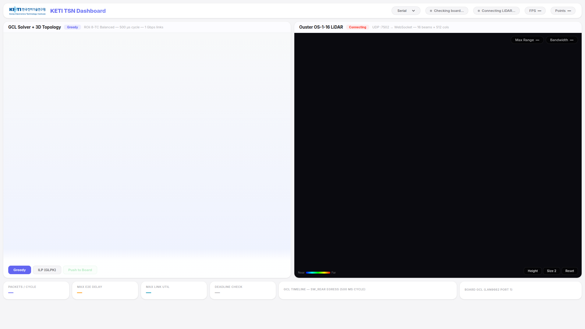
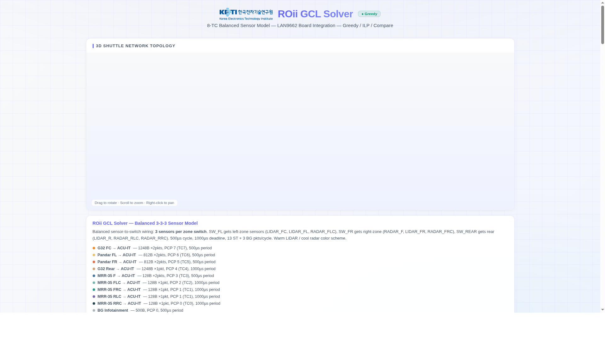
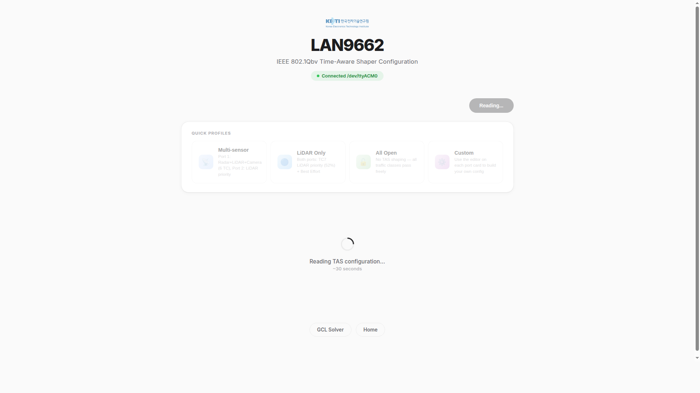

# KETI TSN Platform

ILP/Greedy GCL Solver + Microchip LAN9662 Board Integration + LiDAR Point Cloud


## Overview

TSN(Time-Sensitive Networking) GCL(Gate Control List) 스케줄링을 Greedy/ILP 알고리즘으로 풀고, 결과를 LAN9662 보드에 직접 적용하는 웹 기반 플랫폼입니다.

### Features

- **Unified Dashboard** — 3D 토폴로지 + GCL 솔버 + LiDAR 포인트 클라우드를 한 화면에 통합
- **GCL Solver** — 8-TC 센서 모델 기반 Greedy/ILP(GLPK WASM) 스케줄러. 3D 토폴로지(Three.js + GLB), per-switch Gantt 타임라인, 지연 분석
- **Board Integration** — 솔버 결과를 YANG/CBOR로 변환하여 LAN9662 보드에 CoAP iPATCH 전송. Serial + Ethernet 지원
- **LiDAR Visualization** — Ouster OS-1-16 UDP 스트림을 WebSocket으로 브릿지, Three.js 3D 포인트 클라우드 실시간 렌더링

## Screenshots

| Dashboard | GCL Solver | Board Config |
|:---------:|:----------:|:------------:|
|  |  |  |

## Quick Start

```bash
git clone --recursive https://github.com/hwkim3330/ilp202604.git
cd ilp202604
bash run.sh
# → http://localhost:3000
```

## Pages

| Page | URL | Description |
|------|-----|-------------|
| Home | `/` | 랜딩 페이지, 보드 연결 상태 |
| **Dashboard** | `/dashboard.html` | **통합 대시보드** — 3D + Solver + LiDAR 한 화면 |
| GCL Solver | `/solver.html` | Greedy/ILP 솔버 + 3D 토폴로지 + Gantt + Board Push |
| Board Config | `/board.html` | LAN9662 TAS 설정 읽기/편집 + Quick Profiles |
| LiDAR | `/lidar.html` | Ouster OS-1 실시간 3D 포인트 클라우드 |

## Architecture

```
Browser                          Server (Node.js/Express)
┌──────────────┐                ┌─────────────────────────┐
│ dashboard    │                │                         │
│  Three.js×2  │─── POST ──────│ /api/gcl/push            │
│  GLPK WASM   │   GCL JSON    │  gcl-to-yang.js          │
│              │                │    → YANG/YAML           │
│ solver.html  │                │    → keti-tsn CLI patch  │
│  D3.js Gantt │                │                         │
├──────────────┤                │                         │
│ board.html   │─── GET ───────│ /api/gcl/read            │
│  TAS Editor  │   TAS config  │    → keti-tsn CLI get    │
├──────────────┤                │                         │
│ lidar.html   │◄── WebSocket ─│ lidar-proxy.js           │
│  Point Cloud │   XYZ+I bin   │    ← UDP :7502 (Ouster)  │
└──────────────┘                └─────────────────────────┘
                                   │              │
                              Serial (MUP1)    Ethernet (CoAP)
                              /dev/ttyACM0     192.168.1.x:5683
                                   │              │
                              ┌────┴──────────────┴────┐
                              │     LAN9662 / LAN9692   │
                              │     (TSN Switch)        │
                              └─────────────────────────┘
```

## Board Transport

보드와의 통신은 **Serial**과 **Ethernet** 두 가지 방식을 지원합니다.

| Transport | 연결 | 프로토콜 | 용도 |
|-----------|------|----------|------|
| Serial (기본) | USB /dev/ttyACM0 | MUP1 | 개발/디버깅 |
| Ethernet | UDP 192.168.1.x:5683 | CoAP 직접 | 운영/멀티보드 |

### Ethernet 초기 설정 (최초 1회 Serial 필요)

```bash
cd keti-tsn-cli

# 1. Serial로 L3 VLAN + Static IP 설정
./keti-tsn patch setup/setup-ip-static.yaml -d /dev/ttyACM0

# 2. CoAP no-sec 모드 설정
./keti-tsn patch setup/no-sec.yaml -d /dev/ttyACM0

# 3. 설정 저장 (flash)
./keti-tsn post setup/save-config.yaml -d /dev/ttyACM0

# 4. 보드 재부팅 후 호스트 IP 설정
sudo ip addr add 192.168.1.20/24 dev enp11s0
ping 192.168.1.10

# 5. Ethernet transport 사용
./keti-tsn checksum --transport eth --host 192.168.1.10
```

또는 원클릭 스크립트:
```bash
./setup/init-eth.sh /dev/ttyACM0
```

## Project Structure

```
ilp202604/
├── index.html          # Landing page
├── dashboard.html      # Unified dashboard (NEW)
├── solver.html         # GCL solver (Greedy + ILP)
├── board.html          # Board config viewer/editor
├── lidar.html          # LiDAR point cloud viewer
├── style.css           # Shared styles
├── roii.glb            # 3D vehicle topology model (GLB)
├── docs/               # Screenshots
├── js/
│   └── ilp-core.js     # ILP/Greedy solver core
├── vendor/
│   ├── d3.min.js       # D3.js
│   ├── glpk.js         # GLPK WASM loader
│   └── glpk.wasm       # GLPK WASM binary
├── server/
│   ├── server.js       # Express + WebSocket server
│   ├── board-api.js    # Board API (Serial + Ethernet)
│   ├── gcl-to-yang.js  # GCL → YANG/CBOR converter
│   └── lidar-proxy.js  # Ouster UDP → WebSocket bridge
├── keti-tsn-cli/       # Board CLI tool (git submodule)
└── run.sh              # One-line launcher
```

## API

| Method | Endpoint | Params | Description |
|--------|----------|--------|-------------|
| GET | `/api/board/status` | `transport`, `host`, `device` | Board connection status |
| GET | `/api/gcl/read` | `transport`, `host`, `device` | Read current TAS config |
| POST | `/api/gcl/push` | body: `boardConfigs`, `portMap`, `transport`, `host` | Push GCL to board |
| POST | `/api/gcl/push-port` | body: `port`, `entries`, `transport`, `host` | Push single port TAS |
| POST | `/api/gcl/export` | body: `boardConfigs`, `portMap` | Export as YANG YAML |
| GET | `/api/lidar/stats` | — | LiDAR streaming statistics |

## Hardware

- **Board**: Microchip LAN9662/LAN9692 (Serial: `/dev/ttyACM0` 115200 baud, Ethernet: 192.168.1.x:5683)
- **LiDAR**: Ouster OS-1-16 (UDP port 7502, LEGACY format, 16 beams × 512 cols)
- **NICs**: enp11s0, enp15s0 (TSN test interfaces)

## Tech Stack

- **Frontend**: Three.js (3D topology + point cloud), D3.js (Gantt/charts), GLPK WASM (ILP solver)
- **Backend**: Node.js, Express, WebSocket (ws)
- **Board CLI**: [keti-tsn-cli](https://github.com/hrkim-KETI/keti-tsn-cli) — YANG/CBOR encode, CoAP iPATCH/GET
- **Standards**: IEEE 802.1Qbv (TAS), IEEE 802.1Qav (CBS), CoAP/CORECONF (RFC 7252)
